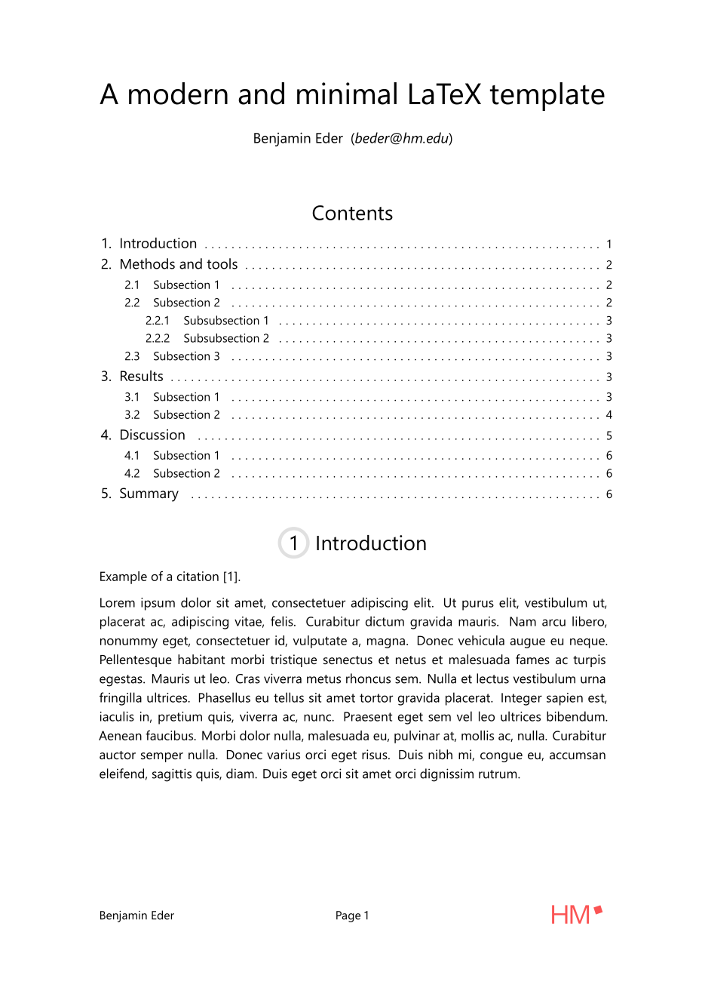

# LaTeX Template

A modern and minimal LaTeX template for digital publishing.

    

## Usage

You need a LaTeX Engine installed (TeX Live, ...).
I recommend installing Tectonic (https://tectonic-typesetting.github.io).
When installing Tectonic you just need to type `tectonic main.tex` and should received a PDF in return.

Note that the template uses `Segoe UI` as font, so you might need to install it or specify another font (See `template/template.tex`) when not using Windows.
